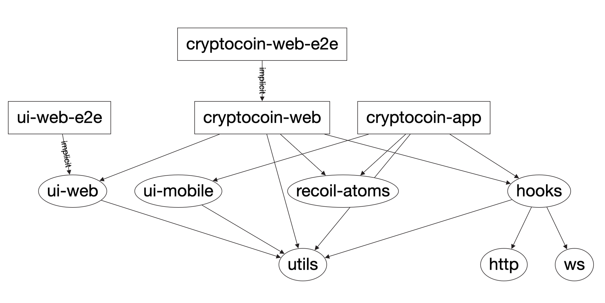

# Coincap

This project was generated using [Nx](https://nx.dev).

Application for crypto currency and real time prices.

## [CryptoCoin web](https://cryptocoin-9f965.web.app/)

## CryptoCoin web

## Architecture

## Technologies

- ### Web
    - [React](https://reactjs.org/)
    - [Recoil (state management)](https://recoiljs.org/docs/introduction/getting-started/)
    - [Materil MUI - (System Design) and Theme](https://material-ui.com/)
    - [React router](https://reactrouter.com/)
    - [lightweight charts "Trading View"](https://www.npmjs.com/package/kaktana-react-lightweight-charts)

- ### React Native
    - [React native](https://reactnative.dev/)
    - [React navigation and Theme configuration](https://reactnavigation.org/)
    - [Recoil (state management)](https://recoiljs.org/docs/introduction/getting-started/)
    - [React native chart kit](https://github.com/indiespirit/react-native-chart-kit)

- ### Testing
    - [Jest](https://jestjs.io/)
    - [React testing library](https://testing-library.com/docs/react-testing-library/intro/)
    - [React Hooks testing library](https://react-hooks-testing-library.com/)
    - [Storybook](https://storybook.js.org/)
    - [Cypress e2e](https://www.cypress.io/)

## Install
- Install yarn
`npm intall -g yarn`
- Install dependencies
`yarn install`

There are also many [community plugins](https://nx.dev/nx-community) you could add.

## Run application web

Run `yarn nx run cryptocoin-web:serve` for a dev server. Navigate to http://localhost:4200/

## Run application app

- Android `yarn nx run cryptocoin-app:run-android`

- IOs `yarn nx run cryptocoin-app:run-ios`

## Running unit tests

Run `yarn nx run cryptocoin-web:test` to execute the unit tests via [Jest](https://jestjs.io).

## Running end-to-end tests

- Run app web `yarn nx run cryptocoin-web-e2e:e2e` to execute the end-to-end tests via [Cypress](https://www.cypress.io).

- Ui-web components `yarn nx run ui-web-e2e:e2e`

## Running storybooks

Run `yarn nx run ui-web:storybook` to see interactive components

## Understand your workspace

Run `nx dep-graph` to see a diagram of the dependencies of your projects.